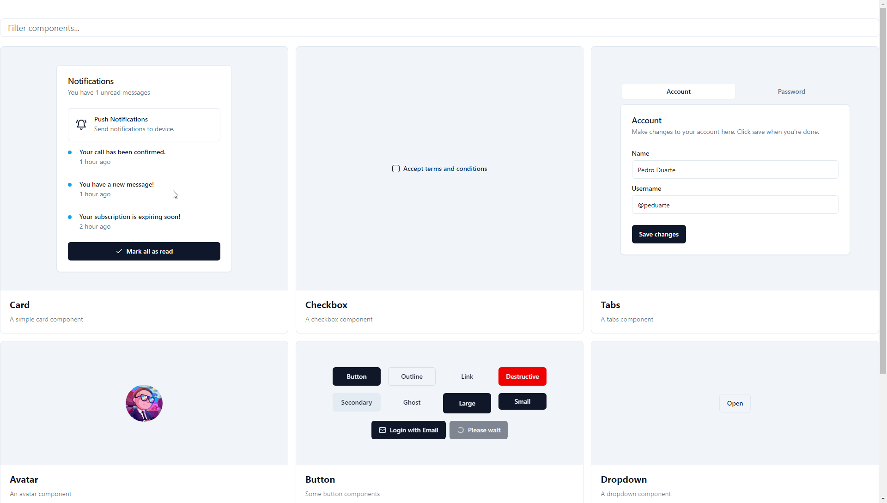
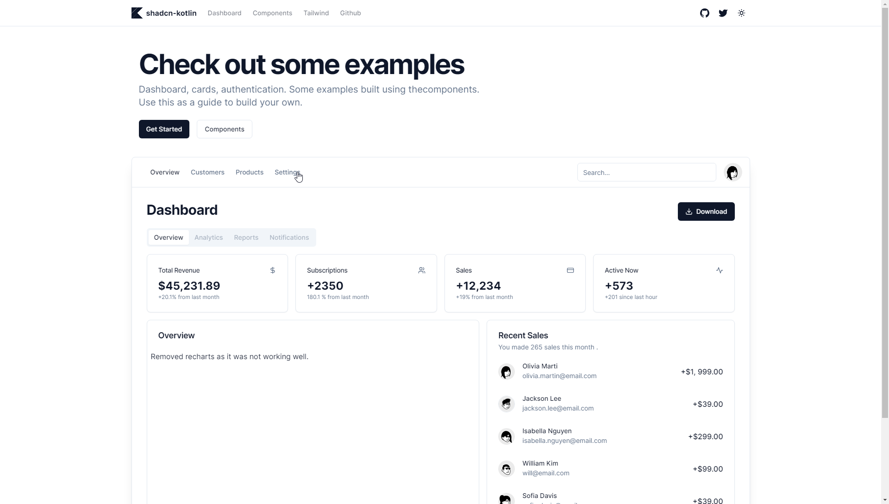

# shadcn-kotlin

This repository showcases the use of shadcn/ui in a Kotlin JS project
using [Kobweb](https://kobweb.varabyte.com/)

## Description

This project created to explore the integration of Kobweb with popular web technologies and libraries. It provides a
platform for testing and experimenting with React Libraries and Tailwind CSS

## Table of Contents

- [Images](#images)
- [Installation](#installation)
- [Usage](#usage)
- [Features](#features)
- [Integration with Tailwind CSS](#integration-with-tailwind-css)
- [Acknowledgement](#acknowledgments)

## Images
* located at `/components` page


* located at `/dashboard` page



## Installation

To install and set up the project locally, follow these steps:

> **Warning**
> Kobweb is essential for this project to work. Follow
> this [guide](https://github.com/varabyte/kobweb#install-the-kobweb-binary) if you don't have kobweb setup

1. Clone the repository:

   ```bash
   git clone https://github.com/dead8309/kobweb-react-tailwind.git
   ```

2. Navigate to the project directory:

   ```bash
   cd kobweb-react-tailwind/site
   ```

## Usage

To run the application, execute the following command:

```bash
kobweb run
```

This will build the project and start a local development server. You can access it in your web browser
at `http://localhost:8080`.

## Features

The Repository showcases the following features:

- Integration of Kotlin JS with React components: Explore how Kotlin interacts with React by creating and using React
  components in Kotlin code.
- Tailwind CSS integration: Utilize the power of Tailwind CSS for styling your Kotlin JS components and UI.
- TSX UI libraries in Kotlin: Experiment with popular TSX UI libraries (e.g., [shadcn/ui](https://ui.shadcn.com/))
  within Kotlin JS projects.

## Integration with Tailwind CSS
Using [tailwind-kt](https://github.con/dead8309/tailwind-kt) gradle plugin which does everything.

You can read my manual configuration [here](./tailwind-integration.md) which I was using before.

## Acknowledgments

Special thanks to excellent people, tools and
resources that make this project possible:

* [Jetbrains](https://github.com/JetBrains) for [Kotlin JS Wrappers](https://github.com/JetBrains/kotlin-wrappers), 
* [facebook](https://github.com/facebook) for [ReactJS](https://github.com/facebook/react)
* [Tailwind Labs](https://github.com/tailwindlabs) for [Tailwind CSS](https://github.com/tailwindlabs/tailwindcss)
* [@verabyte](https://github.com/varabyte/kobweb) for [kobweb](https://github.com/varabyte/kobweb)
* [@nanodeath](https://github.com/nanodeath) for earlier implementation of [tailwind css with KotlinJS](https://github.com/nanodeath/kotlinjs-tailwindcss)
* [@clovis-ai](https://gitlab.com/clovis-ai) for [Updated Gradle Configurations](https://gitlab.com/opensavvy/decouple/-/blob/16bb282309daba3a9b364a53518bc4a6e5f74128/demos/demo-web/build.gradle.kts)
* [@shadcn](https://github.com/shadcn) for [ui](https://github.com/shadcn/ui) components
* [@lukeshay](https://github.com/lukeshay) for [published version](https://github.com/lukeshay/ui) of shadcn library