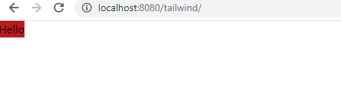

# Integration with Tailwind CSS

To integrate Tailwind CSS with Kobweb, the following steps were followed:

1. Add this to `site/build.gradle.kts`:

   ```kotlin
   kotlin {
        sourceSets {
            val jsMain by getting {
                  dependencies {
                     // this library required as it imports our css file in our kotlin file
                     implementation("org.jetbrains.kotlin-wrappers:kotlin-extensions:1.0.1-pre.256-kotlin-1.5.31")
         
                     implementation(devNpm("tailwindcss", "3.3.2")) 
                     implementation(devNpm("postcss", "8.4.8"))
                     implementation(devNpm("autoprefixer", "10.4.2"))
                     implementation(npm("style-loader", "2.0.0"))
                     implementation(npm("css-loader", "5.2.7"))
                     implementation(devNpm("postcss-loader", "4.3.0"))
         
                     // This is a tailwind plugin to be used when configuring shadcn 
                     implementation(npm("tailwindcss-animate","1.0.5"))
                  }
            }
        }
   }

    val jsWorkspace = "${rootProject.buildDir}/js"
    val jsProjectDir = "$jsWorkspace/packages/${rootProject.name}"
    
    val kotlinNodeJsSetup by rootProject.tasks.getting(org.jetbrains.kotlin.gradle.targets.js.nodejs.NodeJsSetupTask::class)
    val kotlinNpmInstall by rootProject.tasks.getting(org.jetbrains.kotlin.gradle.targets.js.npm.tasks.KotlinNpmInstallTask::class)
    
    val jsProductionExecutableCompileSync by tasks.getting(Task::class)
    
    
    
    val configureTailwind by tasks.registering(Copy::class) {
    description = "Copies the Tailwind configuration file to the build directory"
    
        from("./tailwind.config.js")
        into(jsProjectDir)
    
        dependsOn(kotlinNpmInstall)
    }
    
    val configurePostcss by tasks.registering(Copy::class) {
    description = "Copies the PostCSS configuration file to the build directory"
    
        from("./postcss.config.js")
        into(jsProjectDir)
    
        dependsOn(kotlinNpmInstall)
    }
    
    val jsDevelopmentExecutableCompileSync: Task by tasks.getting {
    dependsOn(
        configureTailwind,
        configurePostcss,
        )
    }
    
    val production by tasks.registering(Exec::class) {
    description = "Compiles the production web demo"
    
        workingDir = file(jsProjectDir)
    
        dependsOn(
            kotlinNodeJsSetup,
            kotlinNpmInstall,
            configureTailwind,
            configurePostcss,
            jsProductionExecutableCompileSync
        )
    }
    
    tasks.getByName("kobwebStart").dependsOn(configureTailwind,configurePostcss)
    tasks.getByName("kobwebExport").dependsOn(configureTailwind,configurePostcss)
    
    tasks.withType(KotlinWebpack::class.java).forEach { t ->
    t.inputs.files(fileTree("src/jsMain/resources"))
   }


   ```

2. Create a Tailwind CSS configuration file inside `site` directory:
   ```javascript
   // site/tailwind.config.js
   
   module.exports = {
    purge: [],
    darkMode: false, // or 'media' or 'class'
    content: ["**/*.{html,js}"] // Most Important 
    theme: {
        extend: {},
    },
    variants: {
        extend: {},
    },
    plugins: [],
   }
   ```

3. Create a Post CSS configuration file inside `site` directory:
   ```javascript
   // site/postcss.config.js
   
   module.exports = {
   plugins: {
      tailwindcss: {},
      autoprefixer: {},
   }
   ```

#### Configure Webpack Loader for PostCSS

* create a directory called `webpack.config.d` inside `site` directory.
* put `postcss-loader.config.js` file inside that folder
   ```javascript
  // postcss-loader.config.js
  
  (() => {
    const cssRule = config.module.rules.find(r => "test.css".match(r.test));
    if (!cssRule) {
        throw new Error("Could not resolve webpack rule matching .css files, did you forget to enable css support?");
    }
    cssRule.use.push({
        loader: "postcss-loader",
        options: {}
    });
  })();
   ```

4. Create a file `globals.css` inside `site/src/jsMain/resources/globals.css`
5. Add this to `globals.css`:
   ```css
   @tailwind base;
   @tailwind components;
   @tailwind utilities;
   ``` 
6. Add this line in our `Page`
   ```kotlin
   @Page
   @Composable
   fun IndexPage() {
        kotlinext.js.require("./globals.css")
        Div({classes("bg-red-700")}){    
            Text("Hello")
        }
   }
   ```
7. All Done👍


